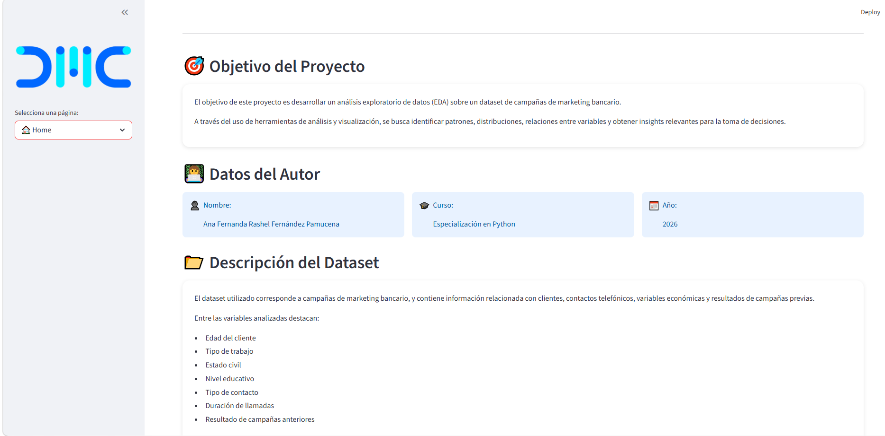
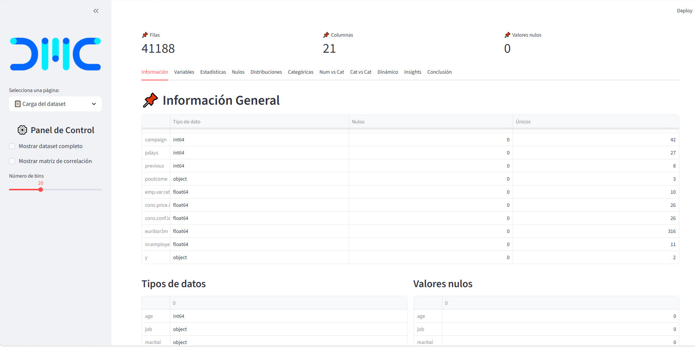
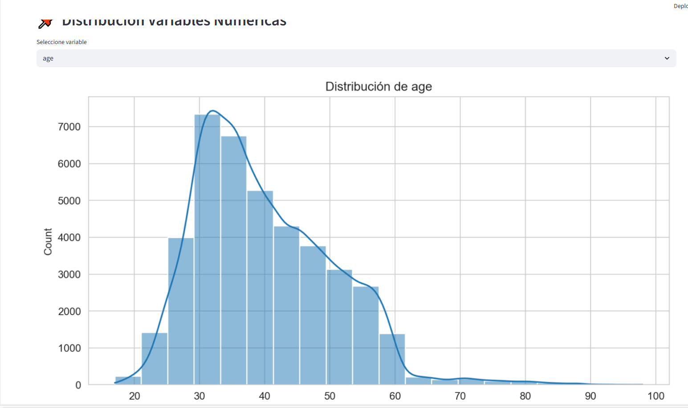
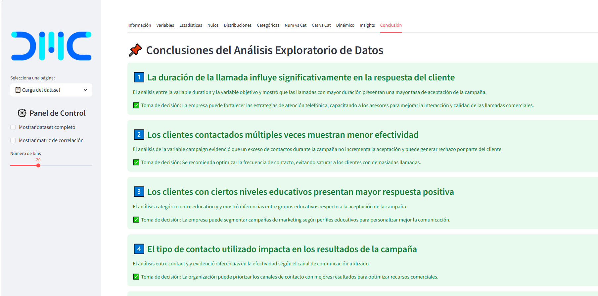

# MiaplicacionCaso1
# 📊 Bank Marketing Analysis - EDA Application


---

# 🚀 Descripción del Proyecto

**Bank Marketing Analysis - EDA Application** es una aplicación interactiva
desarrollada con **Python** y **Streamlit** para realizar un
**Análisis Exploratorio de Datos (EDA)** sobre campañas de marketing bancario.

La aplicación permite analizar información de clientes contactados
por una entidad financiera con el objetivo de identificar patrones,
comportamientos y variables relacionadas con la aceptación
de campañas de marketing.

El proyecto está enfocado en:

- Limpieza y transformación de datos
- Análisis estadístico
- Visualización interactiva
- Identificación de patrones comerciales
- Toma de decisiones basada en datos

El objetivo principal NO es construir modelos predictivos,
sino desarrollar una herramienta analítica funcional,
clara y visualmente organizada.

---

# 📈 Funcionalidades Principales

✅ Carga dinámica de archivos CSV  
✅ Limpieza y preparación de datos  
✅ Clasificación automática de variables  
✅ Estadísticas descriptivas  
✅ Análisis de valores nulos  
✅ Histogramas y gráficos categóricos  
✅ Análisis bivariado  
✅ Dashboard interactivo con Streamlit  
✅ Hallazgos clave orientados al negocio  

---

# 📷 Capturas de la Aplicación

## 🏠 Home



---

## 📊 Información General del Dataset



---

## 📈 Distribución de Variables



---

## 📌 Hallazgos Clave



---

# ⚙️ Tecnologías Utilizadas

- Python
- Streamlit
- Pandas
- NumPy
- Matplotlib
- Seaborn


# 🛠️ Instalación

## 1️⃣ Clonar el repositorio

```bash
git clone https://github.com/tu_usuario/bank-marketing-eda.git
